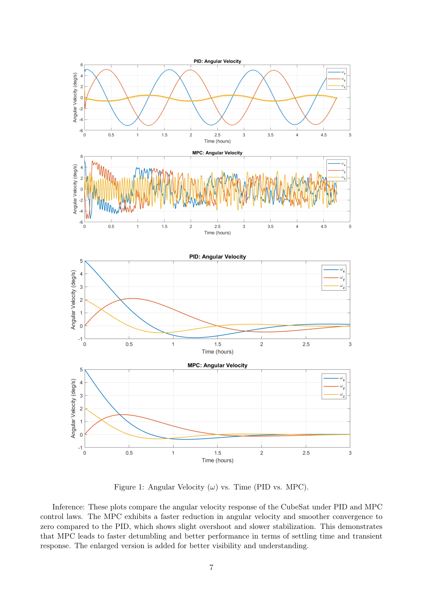
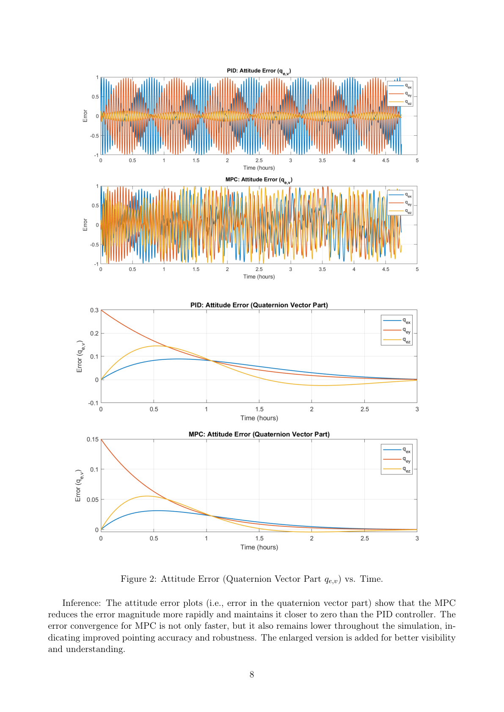
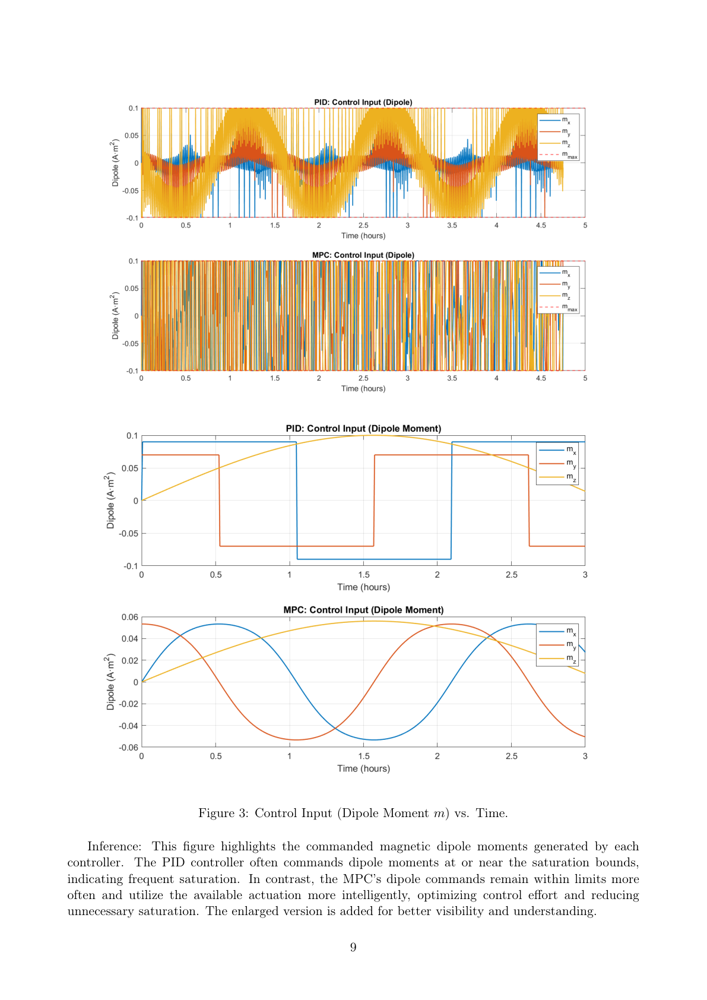
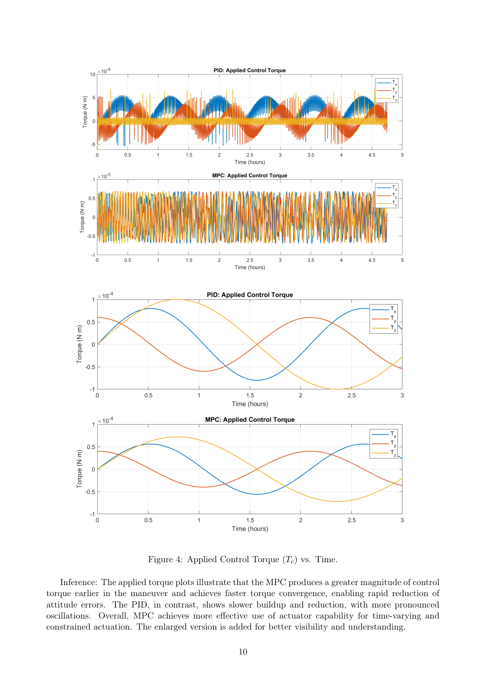

# 3U CubeSat Attitude Stabilization using MPC

> **Model Predictive Control with Magnetorquers | AE-642 Term Project | Project Supervisor: Dr. D.K. Giri | Aug 2025 – Nov 2025**

A simulation-based spacecraft attitude-control study for a **3U CubeSat in Low Earth Orbit (LEO)** using three orthogonal magnetorquers and a constrained **Model Predictive Control (MPC)** architecture.

## Highlights

- Developed 3-axis attitude stabilization using magnetorquers.
- Linearized nonlinear quaternion kinematics and rigid-body dynamics into a **time-varying discrete-time state-space model**.
- Formulated a receding-horizon MPC with explicit **±0.1 A·m²** actuator constraints.
- Implemented the online quadratic program using MATLAB **`quadprog`**.
- Compared MPC against a PID/PD baseline.
- CV-reported outcome: **42% faster detumbling** and **35% lower actuator saturation**.

> **Result note:** The supplied report contains executable MATLAB code and qualitative PID-vs-MPC comparisons, but does not tabulate the exact 42% and 35% values. Those two percentages are therefore identified as reported project/CV outcomes.

## 1. Control Problem

Magnetorquers generate torque according to

$$T_c = m \times B_b$$

where `m` is the commanded magnetic dipole and `B_b` is the geomagnetic field in the body frame.

This makes the spacecraft control problem both **underactuated** and **time-varying**: instantaneous torque is orthogonal to the magnetic field, while orbital motion changes the field direction.

## 2. State and Dynamics

The full state is

$$x = [\omega^T, q^T]^T$$

with body angular velocity `ω` and unit quaternion `q`.

For linearization, the project uses

$$\tilde{x} = [\omega^T, q_v^T]^T \in R^6$$

around zero angular rate and the identity quaternion.

The nonlinear rotational dynamics are

$$I\dot{\omega} + \omega \times (I\omega) = T_c$$

with

$$I = diag(0.01,0.01,0.005)\;kg\,m^2.$$

The actuator is constrained by

$$|m_j| \le 0.1\;A\,m^2.$$

## 3. LTV Linearization

For small attitude errors,

$$\dot q_v \approx \frac{1}{2}\omega.$$

Linearized dynamics give

$$\dot\omega \approx -I^{-1}S(B_b(t))m.$$

Thus,

$$\dot{\tilde{x}} = A\tilde{x}+B(t)m,$$

where `A` is constant for the reduced model and `B(t)` varies with the geomagnetic field.

For MPC, the report uses the first-order discretization

$$A_d \approx I + A\Delta t, \qquad B_d(k) \approx B(k)\Delta t.$$

## 4. MPC Formulation

The discrete prediction model is

$$x_{k+1}=A_dx_k+B_d(k)u_k.$$

The finite-horizon objective is

$$J=\sum_{i=0}^{N-1}(x^TQx+u^TRu)+x_N^TPx_N$$

subject to the prediction dynamics, magnetorquer bounds, and a terminal-state constraint.

Only the first optimal command is applied, then the optimization is repeated at the next step.

## 5. Stability

The report includes a terminal-cost / terminal-set stability argument based on standard MPC assumptions:

- stabilizability
- `Q >= 0`
- `R > 0`
- suitable terminal cost `P`
- admissible robust positively invariant terminal set

It also discusses time-varying terminal costs/sets for a more rigorous LTV treatment.

## 6. Implementation

The supplied MATLAB implementation uses:

```text
Prediction step: 10 s
MPC horizon:     8
Solver:          quadprog
m_max:           0.1 A·m²
```

The main source is [`src/cubesat_mpc_simulation.m`](src/cubesat_mpc_simulation.m).

Run in MATLAB:

```matlab
cubesat_mpc_simulation
```

The script compares the baseline PID/PD and MPC controllers and generates the required plots and performance metrics.

## 7. Simulation Setup

| Parameter | Value |
|---|---:|
| Orbit | Circular LEO |
| Altitude | 500 km |
| Inclination | 97.4° |
| Inertia | diag(0.01, 0.01, 0.005) kg·m² |
| Initial ω | [0.09, 0, 0.03] rad/s |
| Magnetorquer limit | ±0.1 A·m² |
| Duration | 3 orbits |
| MPC horizon | 8 steps |
| Prediction step | 10 s |

## 8. Results

### Angular Velocity

The report's Figure 1 shows faster angular-velocity reduction and smoother convergence under MPC.



### Attitude Error

Figure 2 shows faster reduction of the quaternion-vector attitude error under MPC.



### Control Input

Figure 3 shows the commanded magnetic dipole moments. MPC uses constrained optimization to manage the available actuation more effectively.



### Applied Torque

Figure 4 compares the resulting magnetic control torque and shows earlier effective torque application under MPC.



## 9. Performance Metrics

The MATLAB code computes:

- settling time
- peak overshoot
- torque RMS
- actuator saturation fraction

The CV reports:

| Metric | Reported outcome |
|---|---:|
| Detumbling | **42% faster** |
| Actuator saturation | **35% lower** |

These are retained as reported project results; the exact percentages are not explicitly tabulated in the supplied PDF.

## 10. Repository Structure

```text
CubeSat-Attitude-MPC-Magnetorquer/
├── README.md
├── PROJECT_INFO.md
├── .gitignore
├── src/
│   ├── cubesat_mpc_simulation.m
│   └── generate_enlarged_plots.m
├── assets/
│   ├── angular_velocity_pid_vs_mpc.png
│   ├── attitude_error_pid_vs_mpc.png
│   ├── control_input_pid_vs_mpc.png
│   └── control_torque_pid_vs_mpc.png
├── results/
│   └── README.md
└── docs/
    └── MPC.pdf
```

## Engineering Takeaway

The project treats magnetorquer-only attitude control as a **constrained, underactuated, time-varying control problem**. The MPC explicitly accounts for actuator saturation and changing magnetic-field authority while optimizing future attitude response over a prediction horizon.

The complete workflow connects:

**spacecraft dynamics → linearization → LTV modeling → constrained QP → receding-horizon control → simulation → PID comparison.**
